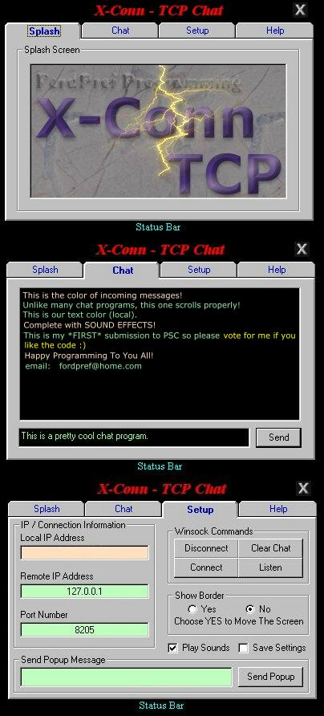



## X\-Conn TCP Chat

### Description

Two-user chat program, complete with SOUND EFFECTS and many other options. EVERY LINE OF CODE is commented so anyone should be able to understand the code and modify it without any trouble. My first PSC submission, all feedback is very much appreciated.
 
### More Info
 

             |
---                |---
**Submitted On**   |2000-07-29 13:31:22
**By**             |[N/A](https://github.com/Planet-Source-Code/PSCIndex/blob/master/ByAuthor/empty.md)
**Level**          |Beginner
**User Rating**    |4.8 (29 globes from 6 users)
**Compatibility**  |VB 6\.0
**Category**       |[Internet/ HTML](https://github.com/Planet-Source-Code/PSCIndex/blob/master/ByCategory/internet-html__1-34.md)
**World**          |[Visual Basic](https://github.com/Planet-Source-Code/PSCIndex/blob/master/ByWorld/visual-basic.md)
**Archive File**   |[CODE\_UPLOAD83367292000\.zip](https://github.com/Planet-Source-Code/x-conn-tcp-chat__1-10192/archive/master.zip)

